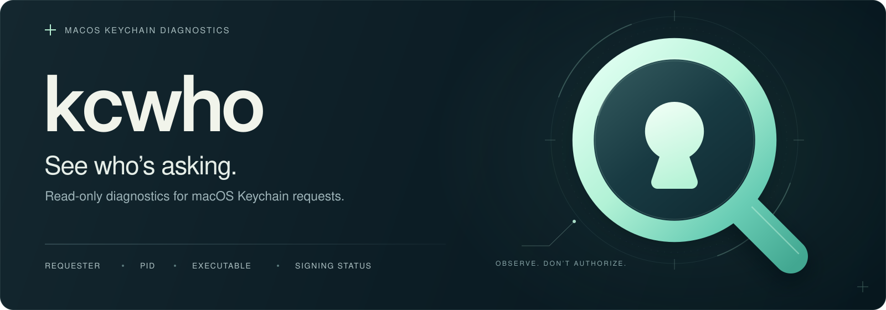
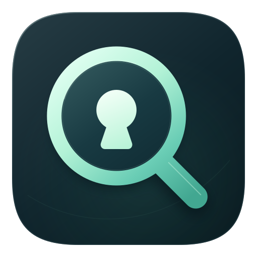

<p align="center">
  
</p>

<p align="center">
  <strong>繁體中文（台灣）</strong> · <a href="README.en.md">English</a>
</p>

<h1> kcwho</h1>

以唯讀方式診斷 macOS「鑰匙圈」的存取權限要求，並在驗證對話框旁顯示原生面板。

kcwho 會回報 **macOS 識別出的直接要求者**、其行程識別碼（PID）、執行檔路徑，以及目前的程式碼簽署狀態。它不會判定允許這項要求是否安全。

## 建置與執行

環境需求：macOS、Apple 的命令列工具（Command Line Tools，包含 `swiftc` 與 Python 3），以及已登入的桌面工作階段。目前版本已在 macOS 15.7.4（Apple 晶片）上測試，其他版本尚未驗證。執行時不需要任何第三方套件。

```bash
git clone https://github.com/andrew54068/kcwho.git
cd kcwho
scripts/install.sh build
./kcwho
./kcwho --json
```

請在顯示對話框的那台 Mac 上，使用「終端機」執行。透過 SSH 或背景工作階段執行時，可能無法取得相同的視窗或鑰匙圈互動狀態。

若只想顯示面板，不安裝登入時啟動的代理程式（LaunchAgent）：

```bash
build/kcwatch --kcwho "$PWD/kcwho"
```

若要立即啟動觀察程式，並在每次登入桌面時自動執行：

```bash
scripts/install.sh install
scripts/install.sh status
# 停止並移除已安裝的觀察程式：
scripts/install.sh uninstall
```

安裝腳本會在本機建置，將程式複製到 `~/Library/Application Support/com.dawson.kcwatch/`，並註冊 `~/Library/LaunchAgents/com.dawson.kcwatch.plist`。狀態訊息會寫入 `~/Library/Logs/kcwatch.log`。修改原始碼後，請重新安裝；代理程式執行的是已安裝的副本。

## 如何解讀結果

面板會列出目前有效的 **作業系統回報的鑰匙圈要求**。JSON 報告在能驗證直接要求者時，使用 `kind: "keychain"`；相關證據不完整或無法取得時，使用 `"unknown"`；未找到仍有效的鑰匙圈查詢時，則使用 `"none"`。`none` 不代表對話框沒有風險，也不表示已識別出它要求的內容。

要求者資訊來自 `securityd` 明確的 `displaying keychain prompt` 事件。查詢的 PID、使用者、背景常駐程式的執行緒，以及查詢建立事件必須相互吻合，才能確認這是一項由作業系統回報的要求。查詢銷毀時，對應的要求也會移除。解析器只採用本次開機、目前背景常駐程式執行個體的事件，再檢查目前執行中的執行檔，以及核心記錄的行程建立時間，以排除 PID 重複使用造成的誤判。

簽署資訊描述的是 **目前的行程身分**，不是行程的意圖，也不是允許存取是否安全。供診斷參考的執行中行程候選項目，會與要求者證據分開列示，且不包含命令列引數。

## 限制

- 系統記錄格式屬於實作細節，並非穩定、公開的觀測 API。事件缺漏、內容遭遮蔽、記錄遺失或格式變更，都可能使要求來源無法確認。即使沒有明確標示記錄遺失，記錄仍可能不完整。
- 部分提示（包括解鎖整個鑰匙圈的要求）不會提供呼叫端的 PID，因此仍會顯示為未知。
- 個別 CoreGraphics 視窗 **不會與查詢物件綁定**。若同時有多項有效要求，面板會分別列出，但無法判定哪一項屬於特定視窗。
- 若直接要求者是 iCloud Helper，背後最初發起要求的 App 仍無法驗證。過去「提醒事項」或「聯絡人」的帳號查詢，無法證明它們就是目前要求的來源。
- 行程身分與要求歸屬是不同的事實。單憑執行中的行程、Apple 簽章、父行程或 `launchd` 工作，都不足以作為要求者證據。

kcwho 無法在所有情況下提供毫無疑義的要求來源判定。請將回報的證據與 macOS 對話框比對；若不清楚要求的用途，請取消該要求。

## 隱私

觀察程式會讀取視窗所屬行程與位置等中繼資料、特定的本機系統記錄，以及行程身分的中繼資料。它不會讀取鑰匙圈項目內容、蒐集行程引數或密碼、輸入憑證、代為允許存取要求，或傳送遙測資料。它不需要 root 權限、「輔助使用」權限或「螢幕錄製」權限。

命令列介面（CLI）的輸出與本機狀態記錄可能包含執行檔路徑、行程名稱及工作標籤。分享前請先檢查。請勿上傳原始系統記錄、鑰匙圈檔案，或含有私人資訊的螢幕截圖。

## 驗證與貢獻

```bash
/usr/bin/python3 scripts/test_kcwho.py
scripts/install.sh build
bash -n scripts/install.sh
```

迴歸測試資料取自實際擷取的 `securityd` 訊息格式範例，且已移除敏感資訊。測試涵蓋過期的輔助程式活動、無關的提示、未知的用戶端、查詢生命週期、多項要求、PID 重複使用、來源與開機狀態檢查、證據缺漏，以及引數隱私。這些測試不能取代實際原生對話框的測試。手動驗證流程與已測試的限制，請參閱 [驗證說明](docs/verification.md)。

一般錯誤或問題請透過 [GitHub Issues](https://github.com/andrew54068/kcwho/issues) 回報。資安漏洞的回報方式請參閱 [安全性政策](SECURITY.md)。開發指引請參閱 [貢獻指南](CONTRIBUTING.md)；所有參與者都應遵守 [行為準則](CODE_OF_CONDUCT.md)。
